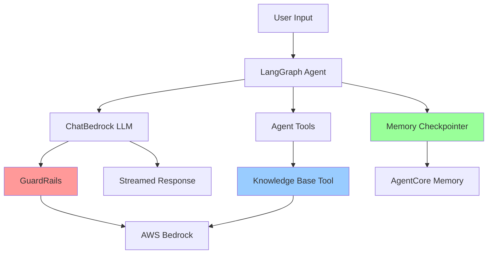

# Design Document: Bedrock Agents Integrations

## Overview

This design document describes the integration of three Amazon Bedrock Agents features into the AgentCore project: GuardRails for content safety, Knowledge Bases for RAG capabilities, and enhanced Memory for conversation persistence. The integrations will work in both local and deployed modes, maintaining the existing streaming architecture while adding powerful AWS-native capabilities.

The design follows a modular approach where each feature can be enabled independently through configuration. All integrations leverage existing AWS SDK and LangChain components to minimize custom code and maximize reliability.

## Architecture

### High-Level Architecture



### Integration Points

1. **GuardRails Integration**: Configured at the LLM level via ChatBedrock parameters
2. **Knowledge Base Integration**: Implemented as a LangChain tool that queries Bedrock Knowledge Bases
3. **Memory Integration**: Configured via LangGraph checkpointer (already partially implemented)

### Deployment Modes

Both local and deployed modes will support all three integrations:

- **Local Mode**: Agents run on developer machines, call AWS Bedrock APIs remotely
- **Deployed Mode**: Agents run on AWS AgentCore Runtime, call AWS Bedrock APIs within AWS network

## Components and Interfaces

### 1. GuardRails Integration Component

#### Configuration Structure

```python
# GuardRails configuration in agent initialization
guardrails_config = {
    "guardrailIdentifier": "gr-abc123xyz",  # GuardRail ID from AWS Console
    "guardrailVersion": "1",                 # Version number or "DRAFT"
    "trace": "enabled"                       # Enable trace for debugging
}
```

#### ChatBedrock Integration

GuardRails are configured directly in the ChatBedrock constructor:

```python
from langchain_aws import ChatBedrock

llm = ChatBedrock(
    model_id=MODEL_ID,
    region_name=REGION,
    guardrails=guardrails_config  # Pass GuardRails config
)
```

#### Intervention Handling

When GuardRails blocks content, Bedrock returns a specific error response. The agent must handle this gracefully:

```python
# GuardRails intervention response structure
{
    "type": "guardrail_intervention",
    "action": "BLOCKED",
    "message": "Content blocked by guardrail policy"
}
```

The streaming logic will detect interventions and yield user-friendly messages.

### 2. Knowledge Base Integration Component

#### Knowledge Base Tool Implementation

The Knowledge Base integration is implemented as a LangChain tool that queries AWS Bedrock Knowledge Bases:

```python
from langchain_aws import AmazonKnowledgeBasesRetriever
from langchain_core.tools import tool

@tool
def query_knowledge_base(query: str) -> str:
    """
    Search the knowledge base for relevant information.
    
    Args:
        query: The search query or question
        
    Returns:
        Formatted results from the knowledge base
    """
    retriever = AmazonKnowledgeBasesRetriever(
        knowledge_base_id=KNOWLEDGE_BASE_ID,
        retrieval_config={
            "vectorSearchConfiguration": {
                "numberOfResults": 5  # Top 5 results
            }
        },
        region_name=REGION
    )
    
    results = retriever.get_relevant_documents(query)
    
    # Format results for the agent
    formatted = []
    for i, doc in enumerate(results, 1):
        formatted.append(f"Result {i}:\n{doc.page_content}\n")
    
    return "\n".join(formatted) if formatted else "No relevant information found."
```

#### Knowledge Base Configuration

```python
# Knowledge Base configuration constants
KNOWLEDGE_BASE_ID = "KB123ABC"  # From AWS Console
KNOWLEDGE_BASE_REGION = "us-east-1"
RETRIEVAL_CONFIG = {
    "vectorSearchConfiguration": {
        "numberOfResults": 5,
        "overrideSearchType": "HYBRID"  # HYBRID, SEMANTIC, or NONE
    }
}
```

### 3. Enhanced Memory Integration Component

The Memory integration is already partially implemented via `AgentCoreMemorySaver`. This design enhances it with better documentation and examples.

#### Memory Configuration

```python
from langgraph_checkpoint_aws import AgentCoreMemorySaver

# Initialize Memory checkpointer
checkpointer = AgentCoreMemorySaver(
    memory_id=MEMORY_ID,      # Memory ID from AWS Console
    region_name=REGION
)

# Create agent with memory
agent = create_agent(
    model=llm,
    tools=tools,
    system_prompt=SYSTEM_PROMPT,
    checkpointer=checkpointer  # Enable memory persistence
)
```

#### Memory Usage Patterns

```python
# Single user, single session
config = {
    "configurable": {
        "thread_id": "session-123",
        "actor_id": "user-456"
    }
}

# Multi-user support
config = {
    "configurable": {
        "thread_id": f"user-{user_id}-session-{session_id}",
        "actor_id": user_id
    }
}
```

### 4. Configuration Management Component

#### Environment-Based Configuration

```python
import os

# GuardRails configuration
GUARDRAIL_ID = os.getenv("BEDROCK_GUARDRAIL_ID", "")
GUARDRAIL_VERSION = os.getenv("BEDROCK_GUARDRAIL_VERSION", "DRAFT")

# Knowledge Base configuration
KNOWLEDGE_BASE_ID = os.getenv("BEDROCK_KNOWLEDGE_BASE_ID", "")

# Memory configuration
MEMORY_ID = os.getenv("BEDROCK_MEMORY_ID", "")

# Validation helper
def validate_config():
    """Validate required configuration is present."""
    if GUARDRAIL_ID and not GUARDRAIL_VERSION:
        raise ValueError("GUARDRAIL_VERSION required when GUARDRAIL_ID is set")
    
    if KNOWLEDGE_BASE_ID and len(KNOWLEDGE_BASE_ID) < 10:
        raise ValueError("Invalid KNOWLEDGE_BASE_ID format")
    
    if MEMORY_ID and len(MEMORY_ID) < 10:
        raise ValueError("Invalid MEMORY_ID format")
```

#### Optional Feature Flags

```python
# Feature flags for optional integrations
ENABLE_GUARDRAILS = bool(GUARDRAIL_ID)
ENABLE_KNOWLEDGE_BASE = bool(KNOWLEDGE_BASE_ID)
ENABLE_MEMORY = bool(MEMORY_ID)
```

### 5. Error Handling Component

#### GuardRails Error Handling

```python
async def stream_with_guardrails(agent, input_data, config=None):
    """Stream agent response with GuardRails error handling."""
    try:
        async for event in agent.astream(input_data, config=config, stream_mode="messages"):
            # Process streaming events
            yield process_event(event)
    except Exception as e:
        error_msg = str(e)
        if "guardrail" in error_msg.lower():
            yield "I apologize, but I cannot provide that response due to content policy restrictions."
        else:
            yield f"An error occurred: {error_msg}"
```

#### Knowledge Base Error Handling

```python
@tool
def query_knowledge_base(query: str) -> str:
    """Query knowledge base with error handling."""
    try:
        retriever = AmazonKnowledgeBasesRetriever(
            knowledge_base_id=KNOWLEDGE_BASE_ID,
            region_name=REGION
        )
        results = retriever.get_relevant_documents(query)
        return format_results(results)
    except Exception as e:
        logger.error(f"Knowledge Base query failed: {e}")
        return f"Unable to search knowledge base: {str(e)}"
```

#### Memory Error Handling

```python
# Memory errors should not crash the agent
try:
    checkpointer = AgentCoreMemorySaver(MEMORY_ID, region_name=REGION)
    agent = create_agent(model=llm, tools=tools, checkpointer=checkpointer)
except Exception as e:
    logger.warning(f"Memory initialization failed: {e}. Running without persistence.")
    agent = create_agent(model=llm, tools=tools)  # No checkpointer
```

## Data Models

### GuardRails Configuration Model

```python
from typing import Optional, Literal
from dataclasses import dataclass

@dataclass
class GuardRailsConfig:
    """Configuration for Bedrock GuardRails."""
    guardrail_id: str
    guardrail_version: str = "DRAFT"
    trace: Literal["enabled", "disabled"] = "enabled"
    
    def to_bedrock_config(self) -> dict:
        """Convert to Bedrock API format."""
        return {
            "guardrailIdentifier": self.guardrail_id,
            "guardrailVersion": self.guardrail_version,
            "trace": self.trace
        }
```

### Knowledge Base Query Model

```python
from typing import List, Optional
from dataclasses import dataclass

@dataclass
class KnowledgeBaseResult:
    """Single result from Knowledge Base query."""
    content: str
    source: Optional[str] = None
    score: Optional[float] = None
    metadata: Optional[dict] = None

@dataclass
class KnowledgeBaseQuery:
    """Knowledge Base query configuration."""
    query: str
    num_results: int = 5
    search_type: Literal["HYBRID", "SEMANTIC"] = "HYBRID"
    
    def to_retrieval_config(self) -> dict:
        """Convert to Bedrock retrieval config format."""
        return {
            "vectorSearchConfiguration": {
                "numberOfResults": self.num_results,
                "overrideSearchType": self.search_type
            }
        }
```

### Memory Configuration Model

```python
from dataclasses import dataclass

@dataclass
class MemoryConfig:
    """Configuration for AgentCore Memory."""
    memory_id: str
    thread_id: str
    actor_id: str
    region: str = "us-east-1"
    
    def to_langgraph_config(self) -> dict:
        """Convert to LangGraph config format."""
        return {
            "configurable": {
                "thread_id": self.thread_id,
                "actor_id": self.actor_id
            }
        }
```

## Correctness Properties

*A property is a characteristic or behavior that should hold true across all valid executions of a system—essentially, a formal statement about what the system should do. Properties serve as the bridge between human-readable specifications and machine-verifiable correctness guarantees.*


### Testable Properties

Based on the prework analysis and property reflection, most requirements in this feature are documentation-focused and not amenable to automated property-based testing. However, we can define properties for the functional aspects of the integrations:

**Property 1: GuardRails Configuration Propagation**

*For any* valid GuardRail ID and version, when an agent is initialized with GuardRails configuration, the ChatBedrock LLM should include that configuration in its initialization parameters.

**Validates: Requirements 3.1, 4.1**

**Property 2: Optional GuardRails Functionality**

*For any* agent configuration, when GuardRails configuration is not provided, the agent should initialize successfully and function normally without GuardRails.

**Validates: Requirements 3.5**

**Property 3: Knowledge Base Tool Registration**

*For any* agent that includes Knowledge_Base integration, the agent's tool list should contain a callable tool function for querying the Knowledge_Base.

**Validates: Requirements 5.1, 6.1**

**Property 4: Knowledge Base Result Formatting**

*For any* Knowledge_Base query result, the tool should return a properly formatted string containing the retrieved content.

**Validates: Requirements 5.2, 6.2**

**Property 5: Knowledge Base Error Resilience**

*For any* Knowledge_Base query that fails, the tool should return an error message string rather than raising an unhandled exception.

**Validates: Requirements 5.5, 12.2**

**Property 6: Configuration Validation**

*For any* invalid configuration value (malformed IDs, incorrect formats), the validation function should detect and report the error with a descriptive message.

**Validates: Requirements 11.4**

**Property 7: Feature Error Resilience**

*For any* error condition in GuardRails, Knowledge_Base, or Memory features, the agent should handle the error gracefully without crashing or hanging.

**Validates: Requirements 12.5**

### Example Test Cases

The following specific scenarios should be tested as examples:

**Example 1: GuardRails Intervention Handling**
- Scenario: GuardRails blocks content due to policy violation
- Expected: Agent returns user-friendly message explaining the intervention
- **Validates: Requirements 3.2, 12.1**

**Example 2: BedrockAgentCoreApp with GuardRails**
- Scenario: Agent with GuardRails is wrapped by BedrockAgentCoreApp
- Expected: Agent initializes and streams responses correctly
- **Validates: Requirements 4.5**

**Example 3: BedrockAgentCoreApp with Knowledge Base**
- Scenario: Agent with Knowledge_Base tool is wrapped by BedrockAgentCoreApp
- Expected: Tool calls work correctly within the streaming contract
- **Validates: Requirements 6.4**

**Example 4: Environment Variable Configuration**
- Scenario: GuardRail and Knowledge_Base IDs are set via environment variables
- Expected: Agent reads and uses the configuration correctly
- **Validates: Requirements 11.1, 11.2**

**Example 5: Missing Configuration Error**
- Scenario: Required configuration is missing or empty
- Expected: Agent provides helpful error message with setup instructions
- **Validates: Requirements 11.5**

**Example 6: Memory Failure Handling**
- Scenario: Memory persistence fails during agent operation
- Expected: Error is logged and agent continues without state persistence
- **Validates: Requirements 12.3**

**Example 7: AWS Credential Error**
- Scenario: AWS credentials are invalid or missing
- Expected: Clear error message with remediation steps
- **Validates: Requirements 12.4**

## Error Handling

### Error Categories

1. **Configuration Errors**: Invalid or missing configuration values
2. **AWS Service Errors**: Bedrock API failures, throttling, permissions
3. **GuardRails Interventions**: Content blocked by safety policies
4. **Knowledge Base Errors**: Query failures, retrieval errors
5. **Memory Errors**: Persistence failures, state corruption

### Error Handling Strategy

#### Configuration Errors

```python
def validate_guardrails_config(config: dict) -> None:
    """Validate GuardRails configuration."""
    if not config.get("guardrailIdentifier"):
        raise ValueError(
            "GuardRail ID is required. "
            "Create a GuardRail in AWS Bedrock Console and set BEDROCK_GUARDRAIL_ID"
        )
    
    if not config.get("guardrailVersion"):
        raise ValueError(
            "GuardRail version is required. "
            "Set BEDROCK_GUARDRAIL_VERSION to a version number or 'DRAFT'"
        )
```

#### AWS Service Errors

```python
import boto3
from botocore.exceptions import ClientError, NoCredentialsError

try:
    # AWS API call
    response = bedrock_client.retrieve(...)
except NoCredentialsError:
    logger.error("AWS credentials not found")
    return "Error: AWS credentials not configured. Run 'aws configure' to set up credentials."
except ClientError as e:
    error_code = e.response['Error']['Code']
    if error_code == 'ThrottlingException':
        return "Error: Request throttled. Please try again in a moment."
    elif error_code == 'AccessDeniedException':
        return "Error: Access denied. Check IAM permissions for Bedrock services."
    else:
        return f"Error: AWS service error - {error_code}"
```

#### GuardRails Interventions

```python
async def stream_with_guardrails_handling(agent, input_data, config=None):
    """Stream responses with GuardRails intervention handling."""
    try:
        async for event in agent.astream(input_data, config=config, stream_mode="messages"):
            yield process_event(event)
    except Exception as e:
        error_msg = str(e).lower()
        if "guardrail" in error_msg or "intervention" in error_msg:
            yield (
                "I apologize, but I cannot provide that response as it violates "
                "content safety policies. Please rephrase your request."
            )
        else:
            raise
```

#### Knowledge Base Errors

```python
@tool
def query_knowledge_base(query: str) -> str:
    """Query knowledge base with comprehensive error handling."""
    try:
        retriever = AmazonKnowledgeBasesRetriever(
            knowledge_base_id=KNOWLEDGE_BASE_ID,
            region_name=REGION
        )
        results = retriever.get_relevant_documents(query)
        
        if not results:
            return "No relevant information found in the knowledge base."
        
        return format_results(results)
        
    except ClientError as e:
        error_code = e.response['Error']['Code']
        if error_code == 'ResourceNotFoundException':
            return (
                f"Knowledge Base not found (ID: {KNOWLEDGE_BASE_ID}). "
                "Please verify the Knowledge Base ID in your configuration."
            )
        elif error_code == 'ValidationException':
            return f"Invalid query format: {str(e)}"
        else:
            logger.error(f"Knowledge Base query failed: {e}")
            return f"Unable to search knowledge base: {error_code}"
    except Exception as e:
        logger.error(f"Unexpected error querying knowledge base: {e}")
        return "An unexpected error occurred while searching the knowledge base."
```

#### Memory Errors

```python
def initialize_agent_with_memory(llm, tools, system_prompt, memory_id):
    """Initialize agent with memory, falling back to stateless if memory fails."""
    try:
        checkpointer = AgentCoreMemorySaver(memory_id, region_name=REGION)
        agent = create_agent(
            model=llm,
            tools=tools,
            system_prompt=system_prompt,
            checkpointer=checkpointer
        )
        logger.info(f"Agent initialized with memory (ID: {memory_id})")
        return agent, True
        
    except Exception as e:
        logger.warning(
            f"Failed to initialize memory (ID: {memory_id}): {e}. "
            "Running without state persistence."
        )
        agent = create_agent(
            model=llm,
            tools=tools,
            system_prompt=system_prompt
        )
        return agent, False
```

### Logging Strategy

```python
import logging

# Configure logging
logging.basicConfig(
    level=logging.INFO,
    format='%(asctime)s - %(name)s - %(levelname)s - %(message)s'
)

logger = logging.getLogger(__name__)

# Log integration status
logger.info(f"GuardRails: {'enabled' if ENABLE_GUARDRAILS else 'disabled'}")
logger.info(f"Knowledge Base: {'enabled' if ENABLE_KNOWLEDGE_BASE else 'disabled'}")
logger.info(f"Memory: {'enabled' if ENABLE_MEMORY else 'disabled'}")

# Log errors with context
logger.error(f"GuardRails intervention: {intervention_message}", extra={
    "guardrail_id": GUARDRAIL_ID,
    "user_prompt": prompt[:100]  # First 100 chars
})
```

## Testing Strategy

### Unit Testing Approach

Unit tests will focus on specific examples and edge cases for each integration:

**GuardRails Tests:**
- Test GuardRails configuration is correctly passed to ChatBedrock
- Test agent initialization with and without GuardRails
- Test GuardRails intervention handling returns appropriate messages
- Test invalid GuardRail ID raises configuration error

**Knowledge Base Tests:**
- Test Knowledge_Base tool is registered in agent's tool list
- Test Knowledge_Base tool returns formatted results
- Test Knowledge_Base tool handles empty results gracefully
- Test Knowledge_Base tool handles API errors without crashing
- Test invalid Knowledge_Base ID raises configuration error

**Memory Tests:**
- Test Memory checkpointer initialization with valid Memory ID
- Test agent falls back to stateless mode when Memory initialization fails
- Test thread_id and actor_id are correctly passed in config
- Test invalid Memory ID raises configuration error

**Configuration Tests:**
- Test environment variables are read correctly
- Test configuration validation detects invalid values
- Test missing required configuration produces helpful error messages

**Integration Tests:**
- Test agent with all three features enabled works correctly
- Test BedrockAgentCoreApp wrapper works with GuardRails
- Test BedrockAgentCoreApp wrapper works with Knowledge_Base tool
- Test streaming works correctly with all integrations

### Property-Based Testing Approach

Property-based tests will validate universal properties across many generated inputs:

**Property Test 1: GuardRails Configuration Propagation**
- Generate random valid GuardRail IDs and versions
- Initialize agents with each configuration
- Verify ChatBedrock includes the configuration
- Run 100+ iterations

**Property Test 2: Optional GuardRails Functionality**
- Generate random agent configurations with and without GuardRails
- Verify all agents initialize successfully
- Verify agents without GuardRails function normally
- Run 100+ iterations

**Property Test 3: Knowledge Base Tool Registration**
- Generate random tool configurations including Knowledge_Base
- Verify Knowledge_Base tool appears in agent's tool list
- Verify tool is callable
- Run 100+ iterations

**Property Test 4: Knowledge Base Result Formatting**
- Generate random Knowledge_Base query results
- Verify tool returns properly formatted strings
- Verify format includes content from results
- Run 100+ iterations

**Property Test 5: Knowledge Base Error Resilience**
- Generate random error conditions for Knowledge_Base queries
- Verify tool returns error message strings
- Verify no unhandled exceptions are raised
- Run 100+ iterations

**Property Test 6: Configuration Validation**
- Generate random invalid configuration values
- Verify validation detects and reports errors
- Verify error messages are descriptive
- Run 100+ iterations

**Property Test 7: Feature Error Resilience**
- Generate random error conditions for all features
- Verify agent handles errors without crashing
- Verify agent continues operation after errors
- Run 100+ iterations

### Testing Configuration

All property-based tests will:
- Use the appropriate PBT library for Python (Hypothesis)
- Run minimum 100 iterations per test
- Include tags referencing the design document property
- Tag format: `# Feature: bedrock-agents-integrations, Property N: [property text]`

Example test structure:

```python
from hypothesis import given, strategies as st
import pytest

# Feature: bedrock-agents-integrations, Property 1: GuardRails Configuration Propagation
@given(
    guardrail_id=st.text(min_size=10, max_size=50),
    guardrail_version=st.one_of(st.just("DRAFT"), st.integers(min_value=1, max_value=10).map(str))
)
def test_guardrails_config_propagation(guardrail_id, guardrail_version):
    """Property: GuardRails configuration is properly passed to ChatBedrock."""
    config = {
        "guardrailIdentifier": guardrail_id,
        "guardrailVersion": guardrail_version
    }
    
    llm = ChatBedrock(
        model_id=MODEL_ID,
        region_name=REGION,
        guardrails=config
    )
    
    # Verify configuration is present in LLM
    assert hasattr(llm, 'guardrails') or 'guardrail' in str(llm.__dict__)
```

### Manual Testing Checklist

Since many requirements are documentation-focused, manual review is necessary:

**Documentation Review:**
- [ ] Verify AWS Console setup instructions are clear and complete
- [ ] Verify code examples are accurate and runnable
- [ ] Verify inline comments explain each integration
- [ ] Verify walkthrough README covers all features
- [ ] Verify troubleshooting guidance is helpful

**Integration Validation:**
- [ ] Test GuardRails blocks inappropriate content
- [ ] Test Knowledge_Base retrieves relevant documents
- [ ] Test Memory persists conversation state
- [ ] Test all features work in local mode
- [ ] Test all features work in deployed mode
- [ ] Test error messages are user-friendly

## Implementation Notes

### File Structure

The implementation will modify existing files and add new documentation:

```
agentcore_demo/
├── local/
│   ├── agent.py                          # Add GuardRails + KB integration
│   ├── agent_with_memory.py              # Enhance with better comments
│   ├── agent_with_all_features.py        # NEW: All features example
│   └── README.md                         # Update with integration docs
│
├── deployed/
│   ├── agent.py                          # Add GuardRails + KB integration
│   ├── agent_with_all_features.py        # NEW: All features example
│   └── README.md                         # Update with integration docs
│
├── docs/
│   └── BEDROCK_AGENTS_WALKTHROUGH.md     # NEW: Comprehensive walkthrough
│
└── README.md                             # Update with feature overview
```

### Dependencies

No new dependencies are required. All integrations use existing packages:
- `langchain-aws` - Already includes GuardRails and Knowledge Base support
- `langgraph-checkpoint-aws` - Already includes Memory support
- `boto3` - Already included for AWS SDK

### AWS Permissions

The following IAM permissions are required:

```json
{
  "Version": "2012-10-17",
  "Statement": [
    {
      "Effect": "Allow",
      "Action": [
        "bedrock:InvokeModel",
        "bedrock:InvokeModelWithResponseStream",
        "bedrock:ApplyGuardrail"
      ],
      "Resource": "*"
    },
    {
      "Effect": "Allow",
      "Action": [
        "bedrock:Retrieve"
      ],
      "Resource": "arn:aws:bedrock:*:*:knowledge-base/*"
    },
    {
      "Effect": "Allow",
      "Action": [
        "bedrock-agent-runtime:GetMemory",
        "bedrock-agent-runtime:PutMemory"
      ],
      "Resource": "arn:aws:bedrock:*:*:memory/*"
    }
  ]
}
```

### Configuration Best Practices

1. **Use Environment Variables**: Store IDs in environment variables, not hardcoded
2. **Validate Early**: Validate configuration at startup, not at first use
3. **Fail Gracefully**: Optional features should degrade gracefully if unavailable
4. **Log Clearly**: Log which features are enabled/disabled at startup
5. **Document Thoroughly**: Include setup instructions in code comments

### Deployment Considerations

**Local Mode:**
- Requires AWS credentials configured via `aws configure`
- All API calls go over internet to AWS Bedrock
- Suitable for development and testing

**Deployed Mode:**
- Runs on AWS infrastructure with IAM role permissions
- API calls stay within AWS network (lower latency)
- Requires proper IAM role configuration in deployment
- Suitable for production workloads

Both modes use identical code for integrations, only differing in how credentials are obtained (local credentials vs IAM role).
